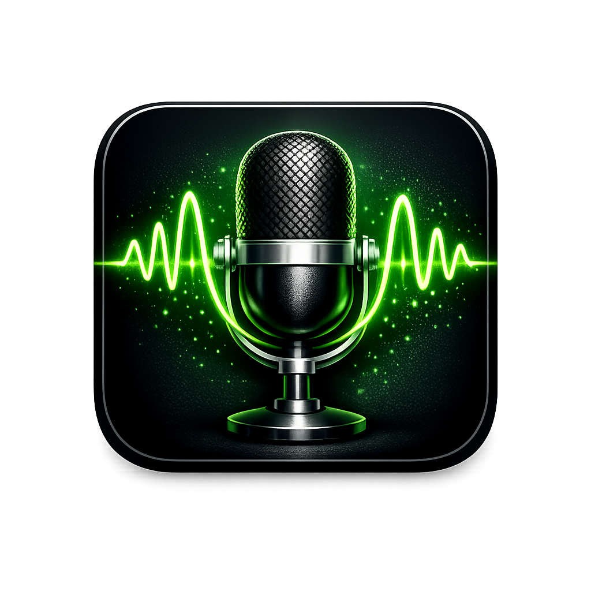

# WaveGrab

<p align="center">
  
</p>

<p align="center">
  <strong>Windows audio recorder that captures system audio and microphone simultaneously using WASAPI</strong>
</p>

<p align="center">
  <a href="#features">Features</a> •
  <a href="#why-wavegrab">Why WaveGrab</a> •
  <a href="#installation">Installation</a> •
  <a href="#usage">Usage</a> •
  <a href="#build-from-source">Build</a>
</p>

---

## Features

- **WASAPI Loopback** - Records system audio from any output device (speakers, USB headsets, Bluetooth)
- **Microphone Mixing** - Combines mic input with system audio in real-time
- **Universal Compatibility** - Works with USB, Bluetooth, and built-in audio devices (unlike Stereo Mix)
- **Independent Volume Controls** - Separate sliders for system and microphone levels
- **Real-time Visualization** - Waveform display and level meters during recording
- **MP3 Export** - Automatic conversion to MP3 after recording
- **Mini Mode** - Compact always-on-top window while recording
- **Pause/Resume** - Pause recording without creating multiple files
- **Persistent Settings** - Remembers your device selection and preferences

## Why WaveGrab?

Windows doesn't natively support recording microphone and system audio together. Existing solutions have drawbacks:

| Solution | Problem |
|----------|---------|
| **Stereo Mix** | Doesn't work with USB/Bluetooth devices |
| **VoiceMeeter** | Complex virtual driver setup |
| **OBS Studio** | Overkill for audio-only recording |
| **Paid software** | Unnecessary cost for a simple task |

**WaveGrab** solves this with a lightweight, single-purpose app using Windows WASAPI loopback - no virtual drivers, no complex setup.

## Installation

### Option 1: Download Release

Download the latest `WaveGrab.exe` from [Releases](../../releases).

### Option 2: Run from Source

```bash
# Clone the repository
git clone https://github.com/yourusername/wavegrab.git
cd wavegrab

# Create virtual environment
python -m venv venv
.\venv\Scripts\activate

# Install dependencies
pip install -r requirements.txt

# Run
python src/main_gui.py
```

### FFmpeg (Required for MP3)

For MP3 conversion, download [FFmpeg](https://ffmpeg.org/download.html) and place both `ffmpeg.exe` and `ffprobe.exe` in the `bin/` folder, or add them to your system PATH.

## Usage

1. **Select Loopback Device** - Choose which output device to record (what you hear)
2. **Select Microphone** - Choose your mic input (optional)
3. **Adjust Volumes** - Set levels for system and mic independently
4. **Click REC** - Start recording
5. **Click STOP** - Stop and save as MP3

### Tips

- Use **Test** button to check audio levels before recording
- **Mini Mode** keeps a small window on top while you work
- Recordings are saved with timestamp: `recording_2025-01-25_143022.mp3`
- Config is saved automatically - your settings persist between sessions

## Build from Source

### Requirements

- Python 3.12+
- Windows 10/11 (64-bit)

### Build Executable

```bash
# Activate virtual environment
.\venv\Scripts\activate

# Install PyInstaller
pip install pyinstaller

# Build
.\build.bat
```

The executable will be created in `dist/WaveGrab.exe`.

## Tech Stack

- **Python 3.12**
- **PyAudioWPatch** - WASAPI loopback support
- **NumPy** - Audio processing and mixing
- **soundfile** - WAV file I/O
- **pydub** - MP3 conversion
- **Tkinter** - GUI

## Project Structure

```
wavegrab/
├── src/
│   ├── main_gui.py      # Entry point
│   ├── devices.py       # WASAPI device enumeration
│   ├── recorder.py      # Audio capture
│   ├── mixer.py         # Stream mixing
│   ├── config.py        # Settings persistence
│   ├── mp3_converter.py # FLAC to MP3 conversion
│   └── gui/
│       ├── app.py       # Main window
│       ├── controller.py# Recording logic
│       └── widgets.py   # Custom UI components
├── assets/              # Icons
├── requirements.txt     # Python dependencies
├── build.spec          # PyInstaller config
└── build.bat           # Build script
```

## License

MIT License - feel free to use, modify, and distribute.

## Contributing

Contributions are welcome! Feel free to:

- Report bugs
- Suggest features
- Submit pull requests

---

<p align="center">
  Made with Python and WASAPI
</p>
